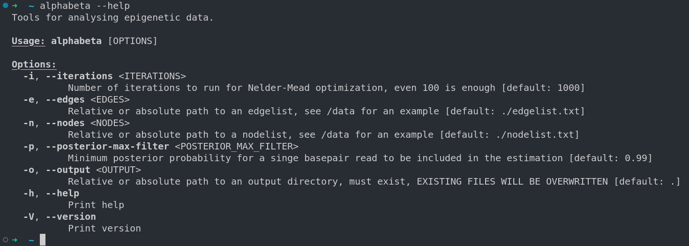
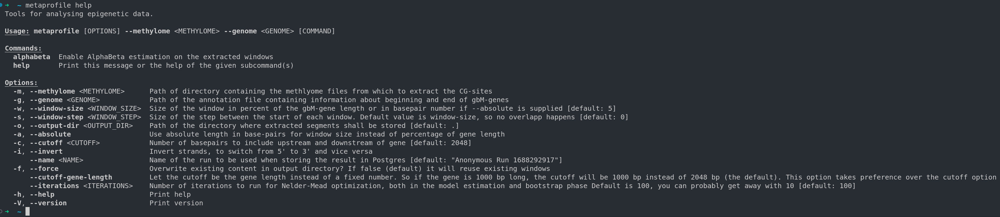

# Alphabeta (but it's fast)

This repostiory contains a fast implementation of the AlphaBeta algorithm first proposed by [Yadollah Shahryary, Frank Johannes and Rashmi Hazarika](https://doi.org/10.5281/zenodo.3992612). The original R implemtation is accessible on Github [here](https://github.com/jlab-code/AlphaBeta/). I matched the original parameters needed for the program, to the old [documentation](https://github.com/jlab-code/AlphaBeta/blob/master/vignettes/AlphaBeta.pdf) is still useful.

Additionally, this repository also contains a program for creating metaprofiles of (epi)genetic data. They are connected, so output from the metaprofile program can automcatically be fed into AlphaBeta.

## How to use

You'll need to install [Rust](https://www.rust-lang.org/tools/install), the programming language used for this project. Then enter the following commands into your terminal:

```bash
cargo install alphabeta
```

This will install the programs on your system. You can then ensure everything works by running:

```bash
alphabeta --help
# and
metaprofile --help
```

### Windows

Windows is currently not supported, but using [WSL2](https://learn.microsoft.com/en-us/windows/wsl/install) on Windows works.

Open powershell and run:

```powershell
wsl --install -d ubuntu
```

Configure your user, open Ubuntu and then install the dependencies and the program:

```bash
sudo apt update
sudo apt install build-essential pkg-config libssl-dev
curl --proto '=https' --tlsv1.2 -sSf https://sh.rustup.rs | sh
cargo install alphabeta
```

<details>
<summary>I get an error!</summary>

If you received an error message about libopenblas, you will need to run the code from inside the repository with cargo (I don't really understand this issue)

```bash
cargo run --release --bin alphabeta
# or
cargo run --release --bin metaprofile
```

</details>

### Updating

If you want to use a new version of the program, just run the following command again:

```bash
cargo install alphabeta
```

## Parameters

### Alphabeta

I tried to make this as easy to use as possible, so every parameter as a (hopefully) sensible default. You can see all the options by running `alphabeta --help`:



When you are in a directory with a `nodelist.txt` and `edgelist.txt` file, you can just run `alphabeta` and it will use default values for everything. If you want to use a different directory, you can supply the `--nodes` and `--edges` as well as the `--output` parameters manually.

### Metaprofile

When using the metaprofile, you will need to supply a methylome directory, a genome annotation file, all other parameters have defaults which you can of course overwrite. You can see all the options by running `metaprofile --help`:



If you want to run AlphaBeta on the metaprofile output, use the `alphabeta` subcommand, which takes the AlphaBeta parameters from above. Note that `alphabeta` must come after the metaprofile options. The full order is: `metaprofile [metaprofile options] alphabeta [alphabeta options]`. The minimum command is therefore:

```bash
metaprofile --methylome [methylome directory] --genome [genome annotation file] alphabeta
```

About window step and size:

Size determines the "length" of each window, for example for `--window-size 5`, each window will span 5% of the length of the gene it is in. If you supply `--absolute`, the size will be interpreted as the number of basepairs instead of a percentage, so 5 bp.

Step determines the distance between the start of each window. If you supply `--window-step 1 and --window-size 5`, the first window will go from 0% to 5% and the second from 1% to 6% and so on. If you supply `--window-step 5 and --window-size 5`, the first window will go from 0% to 5% and the second from 5% to 10% and so on. In the latter case, you can also omit the `step` paramter, as it will default to the same value as `size`.

## Examples

### Run alphabeta

```bash
alphabeta \
--edges ./data/edgelist.txt \
--nodes ./data/nodelist.txt \
--output ./data/output
```

### Create a metaprofile and feed it into AlphaBeta

```bash
metaprofile \
--methylome ../methylome/within_gbM_genes/ \
--genome ../methylome/gbM_gene_anotation_extract_Arabidopsis.bed \
--output-dir /mnt/extStorage/workingDir/./windows/wt \
--name wildtype \
--window-step 1 --window-size 5 \
alphabeta
--edges ../methylome/edgelist.txt \
--nodes ../methylome/nodelist.txt
```
